<div align="center">


# AmberChest — IMAP mail backup in plain .eml files

**Back up IMAP mailboxes to plain `.eml` files you own.** Self-hosted email
archiving for macOS, Windows, Linux and Docker — read-only, incremental, and
with a folder tree that mirrors your mailbox.

[](LICENSE)
[](#install)
[](https://www.typescriptlang.org/)
[](https://github.com/sphings79/amberchest/stargazers)

[Deutsche Version](README.de.md) · [Features](#features) · [Install](#install) · [Desktop or container?](#desktop-or-container) · [Docker](#docker) · [OAuth](#oauth-for-gmail-and-microsoft-365) · [Checking the archive](#checking-the-archive) · [Statistics](#statistics-and-the-register) · [Home Assistant](#home-assistant) · [FAQ](#faq)

**Also part of this project:** [Home Assistant integration](https://github.com/sphings79/amberchest-home-assistant) · [Home Assistant App (Add-on)](https://github.com/sphings79/amberchest-ha-app)

</div>

---

## Why another IMAP backup tool?

Your provider can lose your mail. An account can be closed, a password can be
stolen, a sync can go wrong. A backup that lives on your own disk, in a format
every mail client can read, is the only copy that is really yours.

AmberChest downloads your mailbox and leaves it exactly as it was: **nothing
is deleted on the server, nothing is marked as read.** Folders are opened
read-only and message bodies are fetched with `BODY.PEEK`, the IMAP command
that exists precisely so a client can read a message without touching its
`\Seen` flag.

> **Everything on the roadmap is done.** Backup, attachment export, search,
> viewer, exports, MCP, restore, the container, the remote mode, OAuth, the
> archive check, moving an archive, statistics and the register all work.

## Screenshots

<div align="center">

<em>Every picture shows both looks: dark on the left, light on the right, torn apart down the middle.</em>

<br><br>

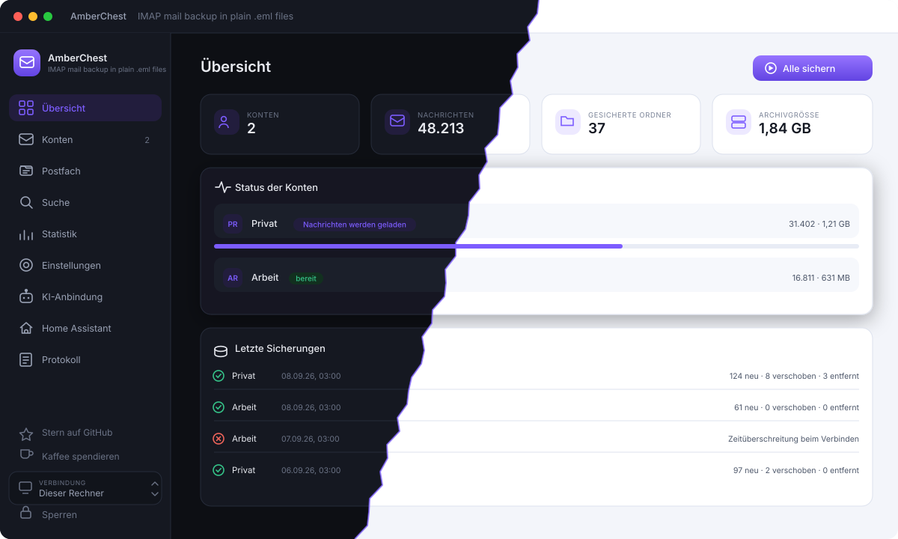

<em>Overview — how much is archived, what is running, what happened last night.</em>

<br><br>

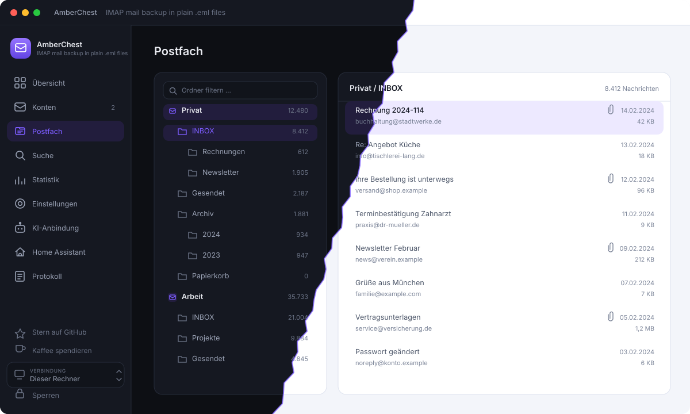

<em>Mailbox — accounts and folders on the left like a file manager, the messages of the selected folder on the right.</em>

<br><br>

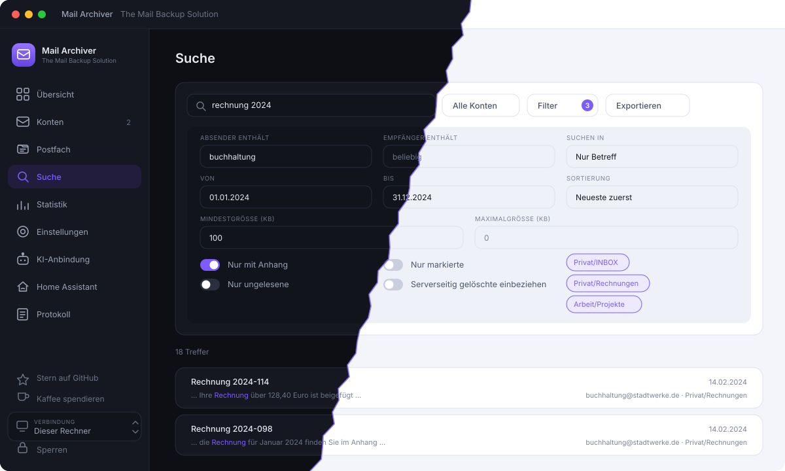

<em>Search — full text over subject, body and attachment content, with filters for
field, sender, recipient, date range, size, read state and sort order.</em>

<br><br>

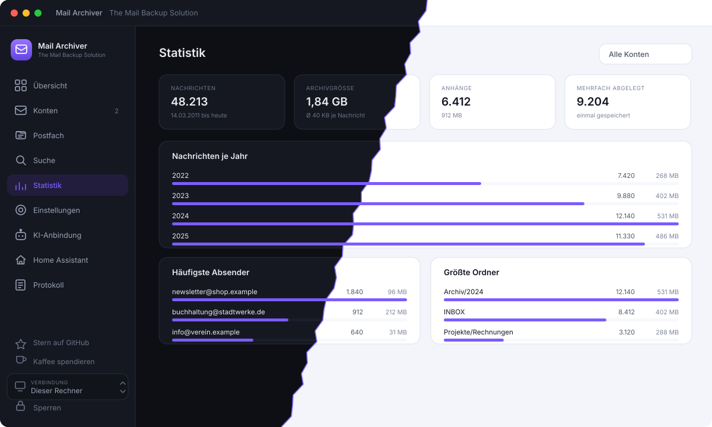

<em>Statistics — what is actually in the archive, straight out of the index: by
year, by sender, by folder, by attachment type.</em>

<br><br>

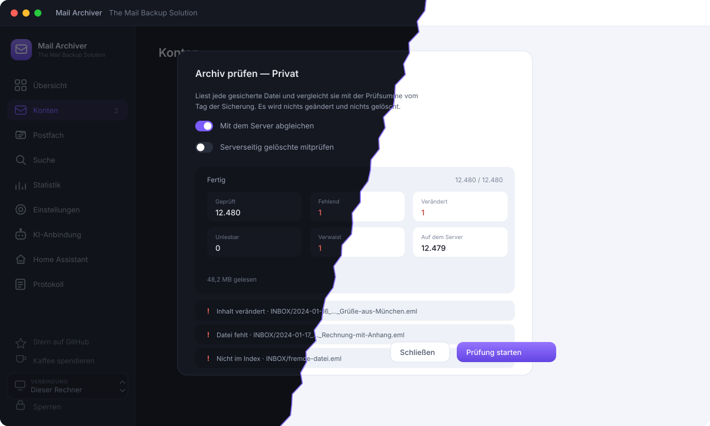

<em>Verify — every file against its checksum, every folder against the server.
What is missing, changed or does not belong in the index is named.</em>

<br><br>

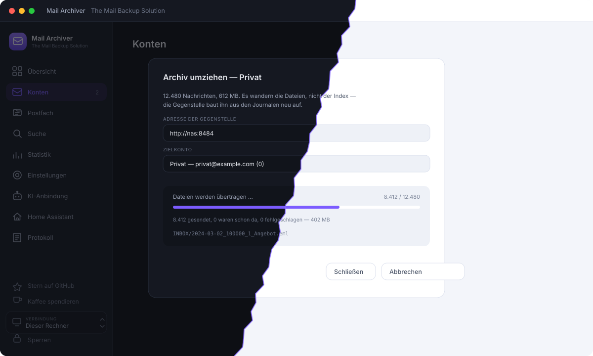

<em>Move — the archive travels to the other instance, which rebuilds its index
from the journals. An interruption is harmless and the first backup over there
downloads nothing.</em>

<br><br>

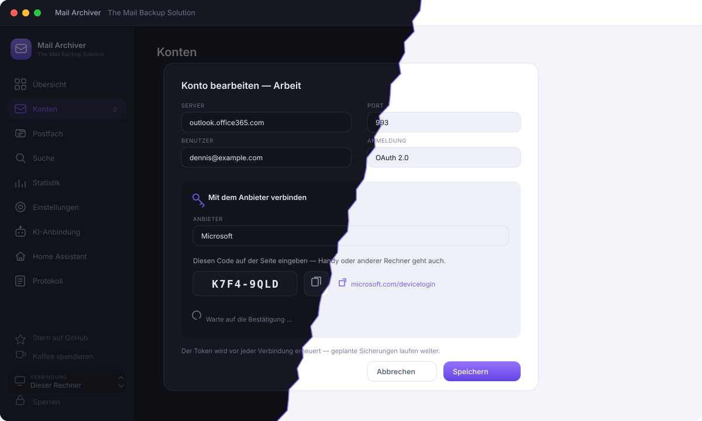

<em>OAuth — Microsoft hands out a code you type on any device, Gmail goes through
the browser. The token is refreshed by itself, so scheduled backups keep
running.</em>

<br><br>

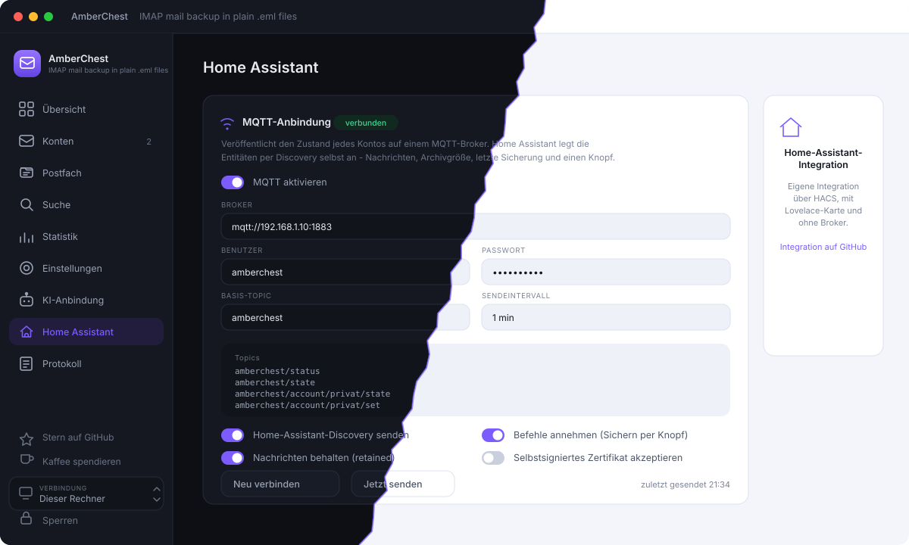

<em>Home Assistant — enter the MQTT broker and you are done: the entities appear
through discovery, with the account in the topic.</em>

<br><br>

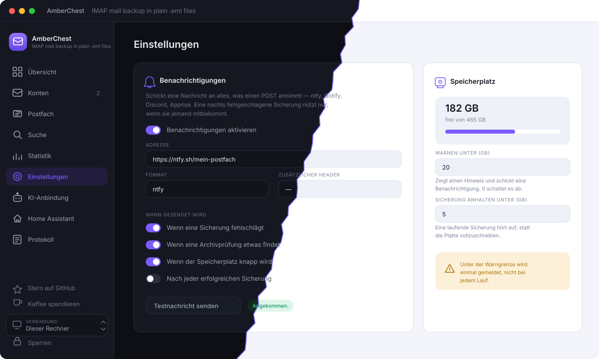

<em>Notifications and disk space — one address that takes a POST is enough, and
two thresholds decide when you get a warning and when a running backup stops.</em>

<br><br>

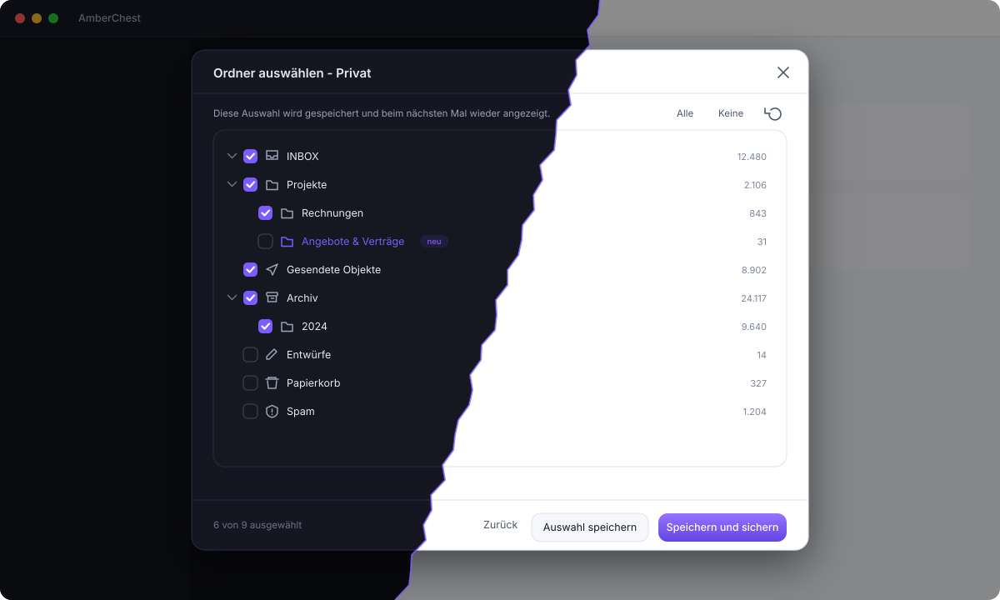

<em>Folder selection — your choice is remembered, new folders are highlighted.</em>

<br><br>

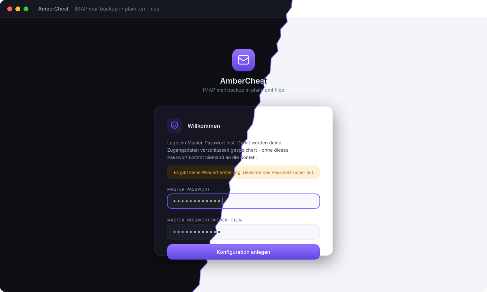

<em>First run — one master password encrypts every credential you enter later.</em>

<br><br>

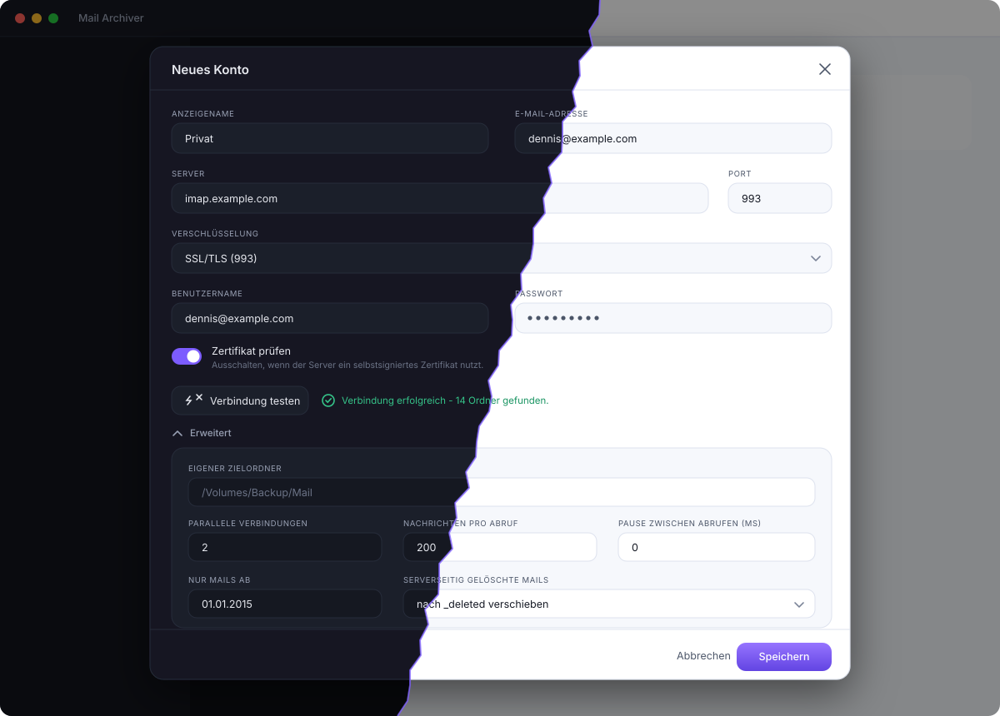

<em>Account setup — connection test, and everything that matters under “Advanced”:
batch size, pause between fetches, date filter and what happens to mail deleted
on the server.</em>

<br><br>

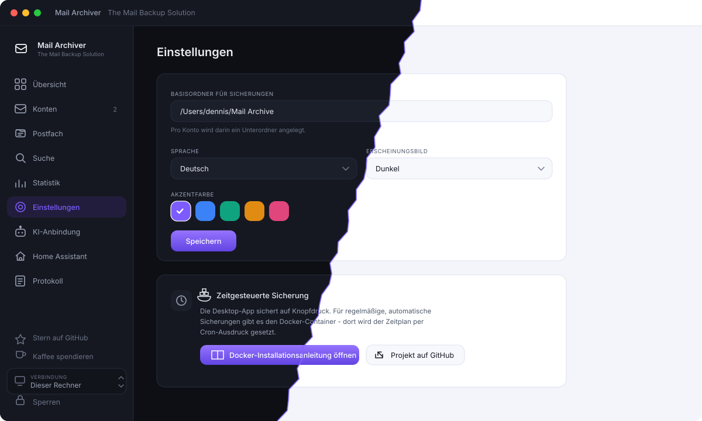

<em>Settings — archive folder, language, light/dark, accent colour, and the way
to the Docker guide.</em>

</div>

## Features

- **IMAP over SSL/TLS, STARTTLS or plain**, with optional acceptance of
  self-signed certificates
- **Read-only by design** — no `\Seen` flags, no deletions, no `EXPUNGE`
- **Folder tree with checkboxes.** The selection is stored per account and
  shown again next time; folders that appeared since the last run are
  highlighted but stay unchecked
- **Special use folders recognised** (Sent, Drafts, Trash, Junk, Archive).
  Trash, Junk and Drafts start unchecked, everything else is pre-selected
- **Incremental backup.** Only new messages are downloaded, no matter how often
  you run it
- **Move detection.** A message you moved between folders on the server is
  moved locally instead of downloaded again — recognised before a single byte
  of the body is fetched
- **Deleted mail handled your way**: keep it, move it to `_deleted/`, or mirror
  the deletion. Optional automatic purge after N days
- **One `.eml` per message** — readable by Thunderbird, Apple Mail, Outlook and
  anything else that speaks RFC 5322
- **Self describing archive.** A per-folder journal lets the index be rebuilt
  from the files alone
- **Encrypted credentials.** One master password, scrypt + AES-256-GCM
- **German and English**, light/dark/system theme, five accent colours
- **Attachment export** as a separate pass over the archive: four layouts
  (folder tree, flat, year/month, one directory per message), filters for
  embedded images, minimum size and file type, de-duplication by content, and a
  CSV/JSON manifest that maps every file back to its message
- **Full text search** over subject, sender, body and attachment content —
  PDF, Word, Excel, PowerPoint and the files inside ZIP and TAR archives are
  read as well. German transliterations are indexed, so "muenchen" finds
  "München" and "strasse" finds "Straße"
- **Message viewer** that renders HTML in a sandboxed frame with external
  content blocked until you ask for it, downloads the .eml or single
  attachments, and hands the message to your mail client so you can reply
- **Export** of any search result as EML files in a ZIP, as an mbox for
  Thunderbird and Apple Mail, or as one PDF per message
- **AI access over MCP** with per-area switches, off by default
- **Restore** to the same account or to a different provider, with a folder
  mapping proposed from the special use markers. Only ever appends: messages
  that are already there are skipped by Message-ID
- **Docker container** with the same web interface, a built-in scheduler and
  Chromium for PDF export
- **Remote mode**: the desktop app can operate a container elsewhere, so the
  scheduled backups run on your server while you look at them from your desk
- **Optional archive encryption** with the master password, for an archive on
  a disk you do not fully control
- **OAuth for Gmail and Microsoft 365**, which no longer accept a password for
  IMAP. Microsoft is connected with a device code, Gmail through a browser; the
  token is refreshed before every connection, so scheduled backups keep running
- **Mailbox browser**: accounts and folders on the left, the messages of the
  selected folder on the right, straight from the local index
- **Archive check.** Every file against the checksum taken when it was
  downloaded, every folder against the count on the server — so "is anything
  missing?" has an answer
- **Move an archive** to another instance from inside the app: the files
  travel, the other side rebuilds its index from the journals, and the first
  backup there downloads nothing
- **Gmail duplicates stored once.** A mail that sits in its folder and in All
  Mail is recognised before anything is fetched: both folders still show it,
  the bytes exist once
- **Protect everything before a date** from deletion, for emptying a mailbox to
  win back space on the server while the archive keeps it
- **Statistics**: messages per year, the frequent senders, the largest folders
  and messages, attachments by type
- **A register in the archive** — an `index.html` per folder linking to the
  `.eml` files beside it, readable without this program
- **Disk space guard**: a warning threshold and one at which a running backup
  stops instead of filling the volume
- **Notifications** to anything that takes a POST — ntfy, Gotify, Discord,
  Apprise — for a failed backup, a finished one, a verification that found
  something, or a volume running low
- **Installable on a phone**: the web interface is a progressive web app
- **Live progress** over a websocket, with a log you can actually read

## Three projects, one archive

| | What it is |
| --- | --- |
| **AmberChest** (here) | The application: desktop app for macOS, Windows and Linux, and a Docker container with the same interface |
| [**AmberChest Integration**](https://github.com/sphings79/amberchest-home-assistant) | Home Assistant integration from HACS: a device per mailbox, sensors, a backup button and a Lovelace card |
| [**Home Assistant App (Add-on)**](https://github.com/sphings79/amberchest-ha-app) | Runs AmberChest on Home Assistant OS, in the sidebar through ingress |

The application stands on its own; the other two are there if you run Home
Assistant.

## Install

Builds for all three desktop platforms come from the same source.

### macOS (Apple Silicon)

Download the DMG from the [releases](https://github.com/sphings79/amberchest/releases)
page, open it and drag the app into `Applications`.

The app is signed, but **not notarised** — there is no paid Apple developer
account behind this project. macOS therefore refuses the first launch with
*"Apple could not verify AmberChest is free of malware"*.

Since macOS 15 the right-click *Open* trick is gone. Try to open the app once,
let it fail, then go to **System Settings → Privacy & Security**, scroll to the
bottom and press **Open Anyway**. Once allowed, it starts normally forever
after.

The same thing from a terminal, if you prefer:

```bash
xattr -dr com.apple.quarantine "/Applications/AmberChest.app"
```

> If macOS says the app is **damaged** instead, you have a build from before
> 1.2.1, released back when this was called Mail Archiver. Those were not
> signed at all, which an Apple Silicon Mac reads as a corrupt bundle.

### Windows

Run the `.exe` installer, or take the portable build if you would rather not
install anything. The build is unsigned, so SmartScreen shows a warning:
*More info* → *Run anyway*.

### Linux

Use the AppImage (make it executable and run it) or install the `.deb`:

```bash
sudo dpkg -i amberchest_2.0.0_amd64.deb
```

Both x64 and arm64 are built.

## Desktop or container?

Both run the same engine and the same interface. Only these differ:

| | Desktop app | Container / add-on |
| --- | --- | --- |
| Backs up while your computer is off | — | ✅ |
| Scheduled backups | — | ✅ cron |
| Reachable from other devices, phone included | — | ✅ |
| A login in front of the interface | — | ✅ |
| OAuth redirect caught by the app itself | ✅ | — paste the address once |
| Open a message in your mail client | ✅ | — download the `.eml` |
| Installed by double-click, no server needed | ✅ | — |

Everything else is identical: backup, attachment export, search, viewer, PDF,
mbox and ZIP export, restore, the archive check, moving an archive, Gmail
linking, the protection date, statistics, the register, notifications, the disk
space guard, MCP and MQTT. The archive on disk has the same shape either way,
so it can go from one to the other — see [Moving an archive](#moving-an-archive).

A common arrangement is both: the container on a NAS or on Home Assistant does
the nightly work, the desktop app connects to it when you want to look at
something.

## Docker

The container runs the same engine and the same web interface as the desktop
app, plus a scheduler. Intended usage on unRAID, Synology or any Docker host:

```bash
docker run -d \
  --name amberchest \
  -p 8484:8484 \
  -v /mnt/user/appdata/amberchest:/config \
  -v /mnt/user/backup/mail:/archive \
  -e AMBERCHEST_MASTER_PASSWORD='your-master-password' \
  -e AMBERCHEST_UI_PASSWORD='password-for-the-web-interface' \
  -e AMBERCHEST_CRON='0 3 * * *' \
  -e TZ=Europe/Berlin \
  ghcr.io/sphings79/amberchest:latest
```

With Docker Compose:

```yaml
services:
  amberchest:
    image: ghcr.io/sphings79/amberchest:latest
    container_name: amberchest
    ports:
      - "8484:8484"
    volumes:
      - ./config:/config
      - /mnt/backup/mail:/archive
    environment:
      AMBERCHEST_MASTER_PASSWORD: your-master-password
      AMBERCHEST_UI_PASSWORD: password-for-the-web-interface
      AMBERCHEST_CRON: "0 3 * * *"
      TZ: Europe/Berlin
    restart: unless-stopped
```

| Variable | Meaning |
| --- | --- |
| `AMBERCHEST_MASTER_PASSWORD` | Unlocks the encrypted configuration on start |
| `AMBERCHEST_UI_PASSWORD` | Password for the web interface |
| `AMBERCHEST_CRON` | Schedule, standard cron expression |
| `AMBERCHEST_PORT` | Port inside the container, default 8484 |
| `AMBERCHEST_CRON_EXPORT_ATTACHMENTS` | Also export attachments after each scheduled run |
| `PUID` / `PGID` | User and group the volumes belong to, default 1000 |
| `AMBERCHEST_LOG_LEVEL` | `debug`, `info`, `warn` or `error` |
| `TZ` | Time zone the schedule follows |

The web interface answers on `http://<host>:8484`. It works behind a reverse
proxy, both on a subdomain and on a sub-path. Images are built for
`linux/amd64` and `linux/arm64`.

## OAuth for Gmail and Microsoft 365

Google and Microsoft no longer accept a password for IMAP. AmberChest can
sign in with a token instead, and it refreshes that token by itself, so a
nightly backup keeps running without anybody at the keyboard.

There is no shared client: a mailbox scope is as sensitive as a permission
gets, and neither provider hands one to an unverified application. Everyone
registers their own client once, under **Settings → OAuth clients**.

### Microsoft 365 and Outlook.com

1. Entra portal → **App registrations** → **New registration**
2. Under **Authentication**, add the platform **Mobile and desktop
   applications** and allow public client flows
3. Copy the **Application (client) ID** into the settings; leave the secret
   empty
4. In the account, pick **OAuth**, then **Get a code**: AmberChest shows a
   short code that you type in on any device

Microsoft supports the device flow, so nothing has to be reachable from
outside — this is the comfortable path for a container.

### Gmail

Google's device flow is documented for sign-in, Drive and YouTube only, so
Gmail has to go through a browser once:

1. Google Cloud console → new project → enable the **Gmail API**
2. **Credentials** → **OAuth client ID** → application type **Desktop**
3. Copy the client ID and secret into the settings
4. In the account, pick **OAuth** and **Sign in with a browser**

Where the browser lands afterwards depends on the redirect you choose:

| Redirect | Needs | How it feels |
| --- | --- | --- |
| Loopback, desktop app | nothing | fully automatic; the app catches the redirect |
| Loopback, container | nothing | the browser lands on a page that does not load — copy that address back into AmberChest |
| Public address | a reachable HTTPS address, registered as a **Web** client | the provider redirects straight back into the interface |

While the project is in testing mode, Google expires the refresh token after
seven days and you have to connect again. Publishing the project (still as
your own private client) removes that limit.

### More than one account at the same provider

One registered client covers as many mailboxes as you like — the client
identifies the application, not the person, and every account consents
separately and gets its own refresh token. Two things to watch:

- While the Google project is in testing mode, **every** Google account has to
  be listed under *Test users*, one by one.
- If you are signed into several accounts in the same browser, the consent
  screen asks which one. AmberChest preselects the address of the account
  you are connecting and logs in once right afterwards, so a token that ended
  up belonging to the wrong mailbox is caught immediately.

A mailbox that genuinely needs a client of its own — a Workspace tenant with
its own app registration, say — can use the **Other** provider slot with its
own endpoints.


## Checking the archive

A backup nobody ever verifies is a hope, not a backup. **Verify** on an account
reads every archived file and compares it with the checksum taken the day it was
downloaded, so a bit that rotted on the disk, a file somebody deleted and a file
that no longer belongs to anything all show up by name.

| Finding | What it means |
| --- | --- |
| File is gone | The index knows the message, the file is not there |
| Content changed | The file no longer matches what came off the server |
| Cannot be read | Damaged, or encrypted with a different master password |
| Not in the index | A message file nothing points at any more |
| Count differs | The folder holds a different number of messages than the server |

**Compare with the server** answers the question one actually has: is anything
missing? It asks the server how many messages each archived folder holds and
puts that next to the local count. One `STATUS` per folder, no message bodies.

Nothing is written to the archive and nothing is deleted. The one change is a
checksum filled in for messages archived before checksums existed — the first
run after an update writes them, and every run after that compares against them.

There is a `verify_archive` tool for the AI connection as well, in the
**Back up** permission group.

## Moving an archive

An archive that started on the desktop belongs on the server sooner or later —
and after a lost index database, the files are still all there. **Move** on an
account sends the archive to another instance, which rebuilds its index from
what arrives.

1. Create the account on the target instance, with the same address
2. **Move** on the source account, enter the address of the target and its
   interface password
3. Pick the target account and start

The files travel, the index does not: every folder carries a journal, and the
other side builds its index from that. Which means an interrupted transfer is
harmless — run it again and only what is still missing is sent, compared by
name and size.

A message keeps the UID it had, so the first backup on the new machine
downloads **nothing**. A file whose journal entry is gone is read instead and
gets UIDVALIDITY zero, which makes the next backup match it to the server by
fingerprint — the same path an actual UIDVALIDITY change takes, and still no
download.

**Nothing is deleted on the source.** Verify the archive on the target and run
one backup there; only when both look right should the old copy go, by hand.

Two things to know:

- An **encrypted archive** travels as it is. The target can only read it with
  the same master password.
- The endpoint that receives files only accepts relative paths ending in `.eml`
  or the journal name, below the account directory. Anything else is refused.


### Moving into the Home Assistant add-on

The add-on normally answers through ingress only, and ingress is not an address
the desktop app can send files to. Two settings on the add-on's **Configuration**
tab open the way:

1. Set an **interface password** (`ui_password`). Without one the add-on refuses
   everything that is not the supervisor — ingress has no login of its own, so
   that guard is the only thing protecting it.
2. Under **Network**, map port `8484` to the host.

The interface then also answers at `http://homeassistant.local:8484`, and that
is the address **Move** wants, together with the interface password. Mapping the
port without setting the password changes nothing: the add-on keeps refusing,
and says so in its log.

**[→ The whole thing step by step, with pictures](https://github.com/sphings79/amberchest-ha-app/blob/main/docs/remote-access.md)**

The same adoption also runs on its own: `POST /api/accounts/<id>/adopt` takes
over an archive directory that is already in place — which is how an index
database is rebuilt after it was lost.

## Gmail: one message, several folders

Gmail shows every mail in its folder **and** in All Mail, so archiving both
stores it twice. Turn on **Store a message only once** in the account's
advanced settings and the second copy becomes a row pointing at the first file:

| | Files | Archive |
| --- | --- | --- |
| Off | 6 | 1080 bytes |
| On | 3 | 540 bytes |

Both folders still show all messages, search finds them, and opening one works
from either side. The message is not even downloaded a second time — it is
recognised from the envelope before a byte of the body is fetched.

When the folder that holds the file loses the message on the server, the file
moves to a folder that still shows it. Deleting one copy never takes the other
with it.

## Statistics and the register

**Statistics** answers what is actually in the archive: messages per year, the
most frequent senders, the largest folders and messages, attachments by type.
All of it comes out of the index, so the page costs a few queries and reads no
file.

**The register** makes the archive usable without this program. It writes an
`index.html` next to the messages — one page per folder, linking to the `.eml`
files beside it, plus an overview. Open it in any browser from a plain
directory: no server, no database, nothing to install. It is written on demand,
from the **Verify** dialog.

## Disk space and notifications

Two things a backup that runs unattended needs: room, and somebody to tell when
there is none.

**Disk space** is shown in the settings, for the volume the archive sits on. Two
limits go with it: a warning threshold, and one at which a running backup
**stops** rather than filling the volume. Stopping leaves a complete archive
that is missing recent mail; filling the disk leaves a machine that cannot even
write a log file.

**Notifications** go to any address that takes a POST, so ntfy, Gotify,
Discord, Apprise and anything self-built all work:

| Event | Default |
| --- | --- |
| A backup failed | on |
| A backup finished | off |
| A verification found something | on |
| Disk space is running low | on |

Pick the format your service speaks, paste the address, and there is a test
button. An extra header field covers services that want a token.

```json
{
  "event": "backupFailed",
  "level": "error",
  "title": "AmberChest: backup of Privat failed",
  "message": "Connection refused - check host and port",
  "text": "…",
  "at": "2026-09-09T02:00:11.000Z",
  "details": { "account": "Privat", "stats": { … } }
}
```

### Emptying the mailbox, keeping the archive

Clearing old mail off the server to win back space there is a normal thing to
do — and the archive is exactly where that mail should survive it. Set
**Never delete anything before** to a date in the account's advanced settings,
and everything older than it stays, whatever happens on the server and whatever
the deletion policy says. Anything newer follows the usual rule.

```
Server emptied, deletion policy "mirror", protected before 2024-01-01:
  2 protected, 1 removed
  files left: the 2019 and the 2020 message
```

The comparison with the server then stops reporting that folder as differing:
holding more than the server is the point of the setting, not a fault.

## AI access over MCP

AmberChest can expose the archive to an AI assistant through the Model
Context Protocol — searching, reading, and, if you allow it, operating the
application. It is **off by default**, and each permission group has its own
switch:

| Group | What it allows |
| --- | --- |
| Read | Search, open messages and attachments, statistics |
| Back up | Start and cancel backups and indexing |
| Export | Attachment export and export bundles |
| Accounts | Create accounts, change server details, set folder selection |
| Settings | Change application settings |
| Delete | Remove accounts, drop the index |

Passwords are never readable through MCP — they can only be set.

**Claude Desktop** (stdio transport):

```json
{
  "mcpServers": {
    "amberchest": {
      "command": "node",
      "args": ["/path/to/amberchest/packages/server/dist/mcp-stdio.js"],
      "env": { "AMBERCHEST_MASTER_PASSWORD": "your-master-password" }
    }
  }
}
```

**Over HTTP** (for the container or a remote client): switch it on in the
settings, copy the generated token and point the client at `POST /mcp` with
`Authorization: Bearer <token>`.

## Home Assistant

AmberChest publishes the state of every account to an MQTT broker, so Home
Assistant can show when a mailbox was last backed up — and start a backup from
a button or an automation. Switch it on under **Home Assistant** in the
sidebar, enter the broker address, done: the entities are created through MQTT
discovery, nothing has to be written into `configuration.yaml`.

The account is part of the topic, so several mailboxes stay apart:

```
amberchest/status                       online / offline
amberchest/state                        totals and the next scheduled run
amberchest/account/<account>/state      one JSON document per mailbox
amberchest/account/<account>/set        backup | cancel
```

Per mailbox you get a device with four entities plus a button:

| Entity | Type |
| --- | --- |
| Messages | sensor |
| Archive size | sensor, `data_size` |
| Last backup | sensor, `timestamp` |
| Backup running | binary sensor, `running` |
| Back up now | button |

Commands are a separate switch. With **Accept commands** turned off the bridge
never subscribes and publishes no button, which makes the connection read only.

An example automation — a notification when a backup fails:

```yaml
automation:
  - alias: Mail backup failed
    triggers:
      - trigger: mqtt
        topic: amberchest/account/privat/state
        value_template: "{{ value_json.last_backup_status }}"
        payload: failed
    actions:
      - action: notify.mobile_app
        data:
          message: "The mail backup failed: {{ trigger.payload_json.last_error }}"
```

### Integration and Home Assistant App

Two companion projects go beyond MQTT:

| Project | What it is |
| --- | --- |
| [AmberChest Integration](https://github.com/sphings79/amberchest-home-assistant) | A native Home Assistant integration, installable through HACS. Talks to this instance directly, brings its own Lovelace card, needs no MQTT broker. |
| [Home Assistant App (Add-on)](https://github.com/sphings79/amberchest-ha-app) | Runs AmberChest as an add-on on Home Assistant OS. Appears in the sidebar through ingress, so it also works in the Home Assistant app on your phone. |

## On your phone

The web interface is installable. Open it in the browser of your phone and
choose **Add to home screen** — it then runs full screen with its own icon,
just like an app. Behind a reverse proxy with HTTPS this works from anywhere;
`http://` only counts as installable on localhost.

## Where things are stored

```
~/AmberChest Archive/                          base folder, one directory per account
└── you@example.com/
    ├── INBOX/
    │   ├── .amberchest.jsonl          metadata journal for this folder
    │   ├── 2024-01-15_143022_10432_Invoice-January.eml
    │   └── Projects/                    subfolders mirror the IMAP hierarchy
    ├── Sent/
    └── _deleted/                        messages that vanished from the server
        └── INBOX/…
```

- The file name carries the UTC timestamp, the IMAP UID and a shortened
  subject; the file modification time is set to the message date, so the
  archive sorts correctly in any file browser.
- `.amberchest.jsonl` records every add, flag change and removal. If the
  SQLite index is ever lost, the archive can be rebuilt from the files alone.
- Folder names keep their umlauts and are normalised to NFC, so the same
  mailbox produces the same paths on macOS, Windows and Linux.

## Security model

`config.enc` holds all IMAP credentials and never exists in plain text. A
master password is turned into a key with scrypt (N=65536, r=8, p=1) and the
file is sealed with AES-256-GCM. The same scheme is used inside the container,
where the master password comes from an environment variable.

The desktop app starts its HTTP server on `127.0.0.1` with a random port and a
random token that is only valid for that launch, so no other process on the
machine can talk to the API.

## Roadmap

| Stage | Content | Status |
| --- | --- | --- |
| 1 | Foundation, accounts, folder selection, incremental backup, desktop app | ✅ done |
| 2 | Attachment export with layouts, filters and de-duplication | ✅ done |
| 3 | Viewer, full text search, "open in mail client", export as mbox/PDF/ZIP, MCP server | ✅ done |
| 4 | Restore, and migration to a different server | ✅ done |
| 5 | Docker image, web login, cron schedule, remote mode | ✅ done |
| 6 | Themes, translations, optional archive encryption, Windows and Linux releases | ✅ done |
| 7 | Mailbox browser, richer search filters, MQTT and the Home Assistant projects | ✅ done |
| 8 | OAuth, archive check, moving an archive, Gmail duplicates, statistics, register | ✅ done |
| next | CalDAV/CardDAV is explicitly **not** planned — this backs up mail |  |

## FAQ

**Does it mark my mail as read?**
No. Folders are opened with `EXAMINE` (read-only) and bodies are fetched with
`BODY.PEEK[]`, which is the whole point of that IMAP command.

**Does it delete anything on the server?**
No. `\Deleted` is never set and `EXPUNGE` is never sent.

**What happens when I delete a mail on the server?**
Whatever you configured per account: keep the local copy, move it into
`_deleted/` (the default, with optional purge after N days), or delete it
locally as well.

**What if I move a mail into another folder?**
It is moved locally too. The match is made on a fingerprint built from
Message-ID, date, sender and size — all available before the body is
downloaded, so nothing is fetched twice.

**Can I read the backup without this program?**
Yes, that is the point of `.eml`. Double-click a file and your mail client
opens it. Thunderbird can import whole folders.

**Does it support POP3?**
No, deliberately. POP3 has no folders and often no stable message identity,
which makes a trustworthy incremental backup impossible.

**Does it support Gmail or Microsoft 365 with OAuth2?**
Yes. Microsoft is connected with a device code, Gmail through the browser, and
the token is refreshed on its own, so scheduled backups keep running. See
[OAuth](#oauth-for-gmail-and-microsoft-365).

**Can I empty my mailbox on the server and keep everything here?**
Yes — that is what the protection date is for. Set a date and nothing older is
ever removed from the archive, no matter what happens on the server.

**How big can a mailbox be?**
Messages are scanned and fetched in batches, and a run can be cancelled and
resumed. The design target is well beyond 100,000 messages.

**Is there a scheduler in the desktop app?**
No. The desktop app backs up on demand; automatic, scheduled runs are what the
Docker container is for.

## Development

Requirements: Node 22 or newer. Docker only for the local test server.

```bash
npm install
npm run build
npm run dev          # desktop app
npm run dev:server   # headless backend
npm run dev:web      # frontend with hot reload
npm test             # unit tests
```

### Local test mailbox

A Dovecot container with a deliberately awkward test mailbox (umlauts,
ampersands, nested folders, special use folders, a message with an attachment):

```bash
docker run -d --name amberchest-dovecot -p 127.0.0.1:11143:143 \
  -v "$PWD/dev/dovecot/dovecot.conf:/etc/dovecot/dovecot.conf:ro" \
  dovecot/dovecot:2.3.21
node dev/seed-testserver.mjs
```

Account: `127.0.0.1:11143`, no encryption, `test@example.com` / `testpass`.

```bash
node dev/test-sync.mjs        # full run, prints the resulting tree
node dev/test-behaviour.mjs   # checks peek, incremental, move and delete
node dev/test-attachments.mjs # checks layouts, filters, de-duplication, manifest
```

### Regenerating the artwork

The screenshots and the social preview are SVG files under `assets/`. GitHub
only accepts PNG for the social preview, so it is rendered with the Chromium
that ships with Electron:

```bash
npx electron dev/render-png.cjs assets/social-preview.svg assets/social-preview.png 1280 640
```

The application icon is generated without any image library:

```bash
python3 dev/make-icon.py packages/desktop/build/icon.png
```

### Project layout

| Package | Purpose |
| --- | --- |
| `packages/core` | IMAP, storage, SQLite index, encryption, sync engine |
| `packages/server` | Fastify REST API, websocket events, serves the frontend |
| `packages/web` | React frontend — identical in the app and in the container |
| `packages/desktop` | Electron shell, starts the server on localhost |
| `docker/` | Container image (stage 5) |

## Support the project

If AmberChest saves your mailbox one day, two things help a lot:

⭐ **[Star the repository](https://github.com/sphings79/amberchest)** —
the cheapest way to help other people find it.

☕ **[Buy me a coffee](https://buymeacoffee.com/sphings)** — development
happens in evenings and weekends.

Bug reports and feature requests are welcome in the
[issues](https://github.com/sphings79/amberchest/issues).

## Licence

AGPL-3.0-or-later. See [LICENSE](LICENSE).

---

<div align="center">
<sub>Keywords: IMAP backup · email backup · mail archiving · self-hosted ·
eml · mbox · Docker · unRAID · homelab · macOS · Windows · Linux ·
imap-backup alternative · mailbox export</sub>
</div>
