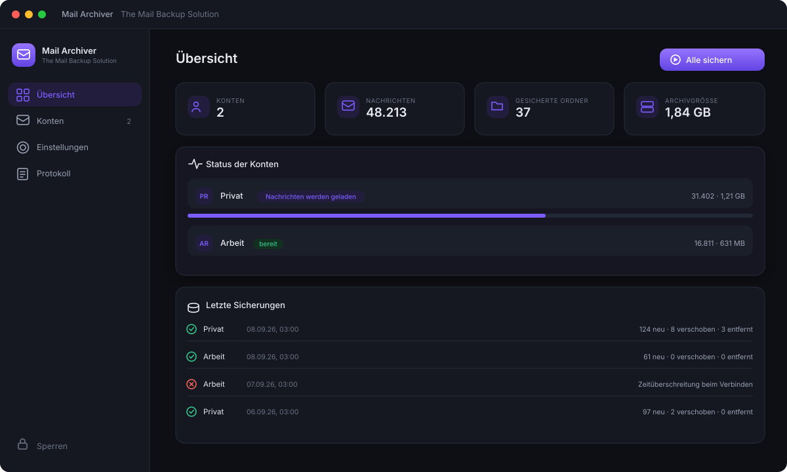
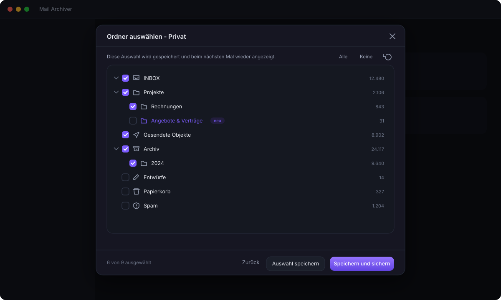
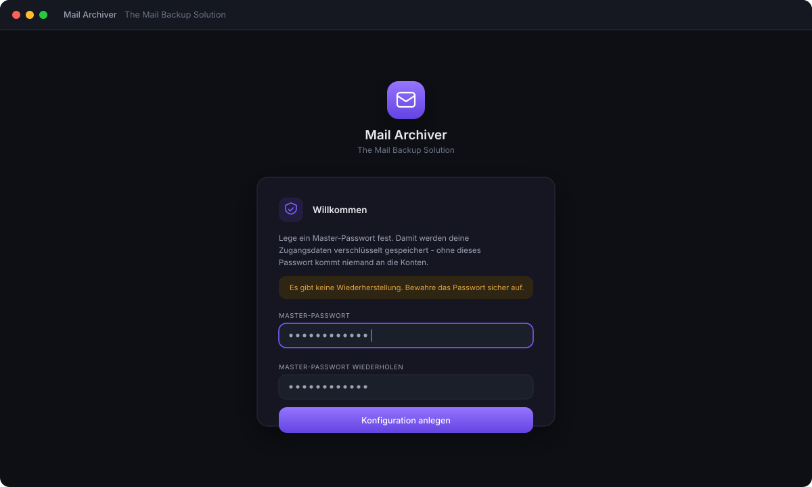
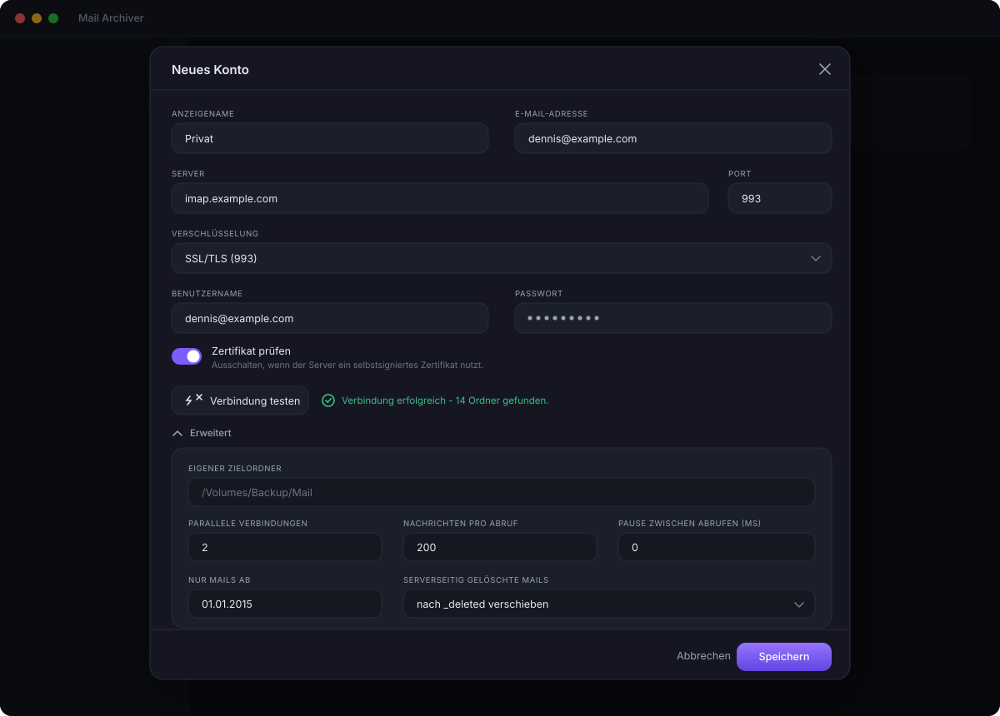
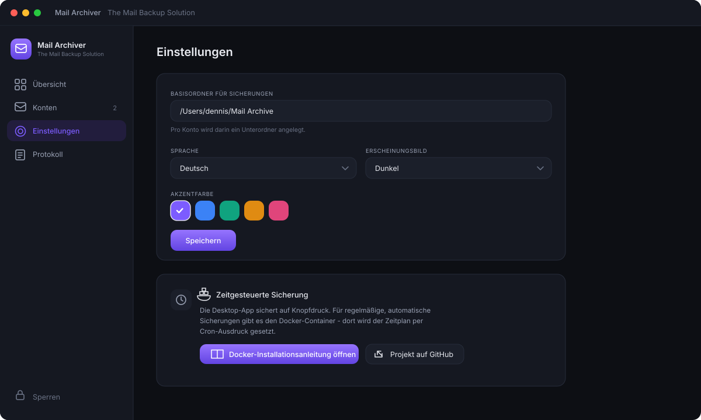

<div align="center">


# Mail Archiver — The Mail Backup Solution

**Back up IMAP mailboxes to plain `.eml` files you own.** Self-hosted email
archiving for macOS, Windows, Linux and Docker — read-only, incremental, and
with a folder tree that mirrors your mailbox.

[](LICENSE)
[](#install)
[](https://www.typescriptlang.org/)
[](https://github.com/sphings79/mail-archiver/stargazers)

[Deutsche Version](README.de.md) · [Features](#features) · [Install](#install) · [Docker](#docker) · [FAQ](#faq)

</div>

---

## Why another IMAP backup tool?

Your provider can lose your mail. An account can be closed, a password can be
stolen, a sync can go wrong. A backup that lives on your own disk, in a format
every mail client can read, is the only copy that is really yours.

Mail Archiver downloads your mailbox and leaves it exactly as it was: **nothing
is deleted on the server, nothing is marked as read.** Folders are opened
read-only and message bodies are fetched with `BODY.PEEK`, the IMAP command
that exists precisely so a client can read a message without touching its
`\Seen` flag.

> **All six stages are done.** Backup, attachment export, search, viewer,
> exports, MCP, restore, the container and the remote mode all work.

## Screenshots

<div align="center">



<em>Overview — how much is archived, what is running, what happened last night.</em>

<br><br>



<em>Folder selection — your choice is remembered, new folders are highlighted.</em>

<br><br>



<em>First run — one master password encrypts every credential you enter later.</em>

<br><br>



<em>Account setup — connection test, and everything that matters under “Advanced”:
batch size, pause between fetches, date filter and what happens to mail deleted
on the server.</em>

<br><br>



<em>Settings — archive folder, language, light/dark, accent colour, and the way
to the Docker guide.</em>

</div>

## Features

- **IMAP over SSL/TLS, STARTTLS or plain**, with optional acceptance of
  self-signed certificates
- **Read-only by design** — no `\Seen` flags, no deletions, no `EXPUNGE`
- **Folder tree with checkboxes.** The selection is stored per account and
  shown again next time; folders that appeared since the last run are
  highlighted but stay unchecked
- **Special use folders recognised** (Sent, Drafts, Trash, Junk, Archive).
  Trash, Junk and Drafts start unchecked, everything else is pre-selected
- **Incremental backup.** Only new messages are downloaded, no matter how often
  you run it
- **Move detection.** A message you moved between folders on the server is
  moved locally instead of downloaded again — recognised before a single byte
  of the body is fetched
- **Deleted mail handled your way**: keep it, move it to `_deleted/`, or mirror
  the deletion. Optional automatic purge after N days
- **One `.eml` per message** — readable by Thunderbird, Apple Mail, Outlook and
  anything else that speaks RFC 5322
- **Self describing archive.** A per-folder journal lets the index be rebuilt
  from the files alone
- **Encrypted credentials.** One master password, scrypt + AES-256-GCM
- **German and English**, light/dark/system theme, five accent colours
- **Attachment export** as a separate pass over the archive: four layouts
  (folder tree, flat, year/month, one directory per message), filters for
  embedded images, minimum size and file type, de-duplication by content, and a
  CSV/JSON manifest that maps every file back to its message
- **Full text search** over subject, sender, body and attachment content —
  PDF, Word, Excel, PowerPoint and the files inside ZIP and TAR archives are
  read as well. German transliterations are indexed, so "muenchen" finds
  "München" and "strasse" finds "Straße"
- **Message viewer** that renders HTML in a sandboxed frame with external
  content blocked until you ask for it, downloads the .eml or single
  attachments, and hands the message to your mail client so you can reply
- **Export** of any search result as EML files in a ZIP, as an mbox for
  Thunderbird and Apple Mail, or as one PDF per message
- **AI access over MCP** with per-area switches, off by default
- **Restore** to the same account or to a different provider, with a folder
  mapping proposed from the special use markers. Only ever appends: messages
  that are already there are skipped by Message-ID
- **Docker container** with the same web interface, a built-in scheduler and
  Chromium for PDF export
- **Remote mode**: the desktop app can operate a container elsewhere, so the
  scheduled backups run on your server while you look at them from your desk
- **Optional archive encryption** with the master password, for an archive on
  a disk you do not fully control
- **Live progress** over a websocket, with a log you can actually read

## Install

Builds for all three desktop platforms come from the same source.

### macOS (Apple Silicon)

Download the DMG from the [releases](https://github.com/sphings79/mail-archiver/releases)
page, open it and drag the app into `Applications`.

The app is **not notarised** — there is no paid Apple developer account behind
this project. On first launch macOS refuses to open it. Right-click the app and
choose *Open*, then confirm. Alternatively:

```bash
xattr -dr com.apple.quarantine "/Applications/Mail Archiver.app"
```

### Windows

Run the `.exe` installer, or take the portable build if you would rather not
install anything. The build is unsigned, so SmartScreen shows a warning:
*More info* → *Run anyway*.

### Linux

Use the AppImage (make it executable and run it) or install the `.deb`:

```bash
sudo dpkg -i mail-archiver_1.0.0_amd64.deb
```

Both x64 and arm64 are built.

## Docker

> The image is built and tested; publishing to the registry happens with the
> first release.

The container runs the same engine and the same web interface as the desktop
app, plus a scheduler. Intended usage on unRAID, Synology or any Docker host:

```bash
docker run -d \
  --name mail-archiver \
  -p 8484:8484 \
  -v /mnt/user/appdata/mail-archiver:/config \
  -v /mnt/user/backup/mail:/archive \
  -e MAIL_ARCHIVER_MASTER_PASSWORD='your-master-password' \
  -e MAIL_ARCHIVER_UI_PASSWORD='password-for-the-web-interface' \
  -e MAIL_ARCHIVER_CRON='0 3 * * *' \
  -e TZ=Europe/Berlin \
  ghcr.io/sphings79/mail-archiver:latest
```

With Docker Compose:

```yaml
services:
  mail-archiver:
    image: ghcr.io/sphings79/mail-archiver:latest
    container_name: mail-archiver
    ports:
      - "8484:8484"
    volumes:
      - ./config:/config
      - /mnt/backup/mail:/archive
    environment:
      MAIL_ARCHIVER_MASTER_PASSWORD: your-master-password
      MAIL_ARCHIVER_UI_PASSWORD: password-for-the-web-interface
      MAIL_ARCHIVER_CRON: "0 3 * * *"
      TZ: Europe/Berlin
    restart: unless-stopped
```

| Variable | Meaning |
| --- | --- |
| `MAIL_ARCHIVER_MASTER_PASSWORD` | Unlocks the encrypted configuration on start |
| `MAIL_ARCHIVER_UI_PASSWORD` | Password for the web interface |
| `MAIL_ARCHIVER_CRON` | Schedule, standard cron expression |
| `MAIL_ARCHIVER_PORT` | Port inside the container, default 8484 |
| `MAIL_ARCHIVER_CRON_EXPORT_ATTACHMENTS` | Also export attachments after each scheduled run |
| `PUID` / `PGID` | User and group the volumes belong to, default 1000 |
| `MAIL_ARCHIVER_LOG_LEVEL` | `debug`, `info`, `warn` or `error` |
| `TZ` | Time zone the schedule follows |

The web interface answers on `http://<host>:8484`. It works behind a reverse
proxy, both on a subdomain and on a sub-path. Images are built for
`linux/amd64` and `linux/arm64`.

## AI access over MCP

Mail Archiver can expose the archive to an AI assistant through the Model
Context Protocol — searching, reading, and, if you allow it, operating the
application. It is **off by default**, and each permission group has its own
switch:

| Group | What it allows |
| --- | --- |
| Read | Search, open messages and attachments, statistics |
| Back up | Start and cancel backups and indexing |
| Export | Attachment export and export bundles |
| Accounts | Create accounts, change server details, set folder selection |
| Settings | Change application settings |
| Delete | Remove accounts, drop the index |

Passwords are never readable through MCP — they can only be set.

**Claude Desktop** (stdio transport):

```json
{
  "mcpServers": {
    "mail-archiver": {
      "command": "node",
      "args": ["/path/to/mail-archiver/packages/server/dist/mcp-stdio.js"],
      "env": { "MAIL_ARCHIVER_MASTER_PASSWORD": "your-master-password" }
    }
  }
}
```

**Over HTTP** (for the container or a remote client): switch it on in the
settings, copy the generated token and point the client at `POST /mcp` with
`Authorization: Bearer <token>`.

## Where things are stored

```
~/Mail Archive/                          base folder, one directory per account
└── you@example.com/
    ├── INBOX/
    │   ├── .mailarchiver.jsonl          metadata journal for this folder
    │   ├── 2024-01-15_143022_10432_Invoice-January.eml
    │   └── Projects/                    subfolders mirror the IMAP hierarchy
    ├── Sent/
    └── _deleted/                        messages that vanished from the server
        └── INBOX/…
```

- The file name carries the UTC timestamp, the IMAP UID and a shortened
  subject; the file modification time is set to the message date, so the
  archive sorts correctly in any file browser.
- `.mailarchiver.jsonl` records every add, flag change and removal. If the
  SQLite index is ever lost, the archive can be rebuilt from the files alone.
- Folder names keep their umlauts and are normalised to NFC, so the same
  mailbox produces the same paths on macOS, Windows and Linux.

## Security model

`config.enc` holds all IMAP credentials and never exists in plain text. A
master password is turned into a key with scrypt (N=65536, r=8, p=1) and the
file is sealed with AES-256-GCM. The same scheme is used inside the container,
where the master password comes from an environment variable.

The desktop app starts its HTTP server on `127.0.0.1` with a random port and a
random token that is only valid for that launch, so no other process on the
machine can talk to the API.

## Roadmap

| Stage | Content | Status |
| --- | --- | --- |
| 1 | Foundation, accounts, folder selection, incremental backup, desktop app | ✅ done |
| 2 | Attachment export with layouts, filters and de-duplication | ✅ done |
| 3 | Viewer, full text search, "open in mail client", export as mbox/PDF/ZIP, MCP server | ✅ done |
| 4 | Restore, and migration to a different server | ✅ done |
| 5 | Docker image, web login, cron schedule, remote mode | ✅ done |
| 6 | Polish: themes, translations, optional archive encryption, Windows and Linux releases | planned |

## FAQ

**Does it mark my mail as read?**
No. Folders are opened with `EXAMINE` (read-only) and bodies are fetched with
`BODY.PEEK[]`, which is the whole point of that IMAP command.

**Does it delete anything on the server?**
No. `\Deleted` is never set and `EXPUNGE` is never sent.

**What happens when I delete a mail on the server?**
Whatever you configured per account: keep the local copy, move it into
`_deleted/` (the default, with optional purge after N days), or delete it
locally as well.

**What if I move a mail into another folder?**
It is moved locally too. The match is made on a fingerprint built from
Message-ID, date, sender and size — all available before the body is
downloaded, so nothing is fetched twice.

**Can I read the backup without this program?**
Yes, that is the point of `.eml`. Double-click a file and your mail client
opens it. Thunderbird can import whole folders.

**Does it support POP3?**
No, deliberately. POP3 has no folders and often no stable message identity,
which makes a trustworthy incremental backup impossible.

**Does it support Gmail or Microsoft 365 with OAuth2?**
Not yet — app passwords work today, OAuth2 is planned.

**How big can a mailbox be?**
Messages are scanned and fetched in batches, and a run can be cancelled and
resumed. The design target is well beyond 100,000 messages.

**Is there a scheduler in the desktop app?**
No. The desktop app backs up on demand; automatic, scheduled runs are what the
Docker container is for.

## Development

Requirements: Node 22 or newer. Docker only for the local test server.

```bash
npm install
npm run build
npm run dev          # desktop app
npm run dev:server   # headless backend
npm run dev:web      # frontend with hot reload
npm test             # unit tests
```

### Local test mailbox

A Dovecot container with a deliberately awkward test mailbox (umlauts,
ampersands, nested folders, special use folders, a message with an attachment):

```bash
docker run -d --name mail-archiver-dovecot -p 127.0.0.1:11143:143 \
  -v "$PWD/dev/dovecot/dovecot.conf:/etc/dovecot/dovecot.conf:ro" \
  dovecot/dovecot:2.3.21
node dev/seed-testserver.mjs
```

Account: `127.0.0.1:11143`, no encryption, `test@example.com` / `testpass`.

```bash
node dev/test-sync.mjs        # full run, prints the resulting tree
node dev/test-behaviour.mjs   # checks peek, incremental, move and delete
node dev/test-attachments.mjs # checks layouts, filters, de-duplication, manifest
```

### Regenerating the artwork

The screenshots and the social preview are SVG files under `assets/`. GitHub
only accepts PNG for the social preview, so it is rendered with the Chromium
that ships with Electron:

```bash
npx electron dev/render-png.cjs assets/social-preview.svg assets/social-preview.png 1280 640
```

The application icon is generated without any image library:

```bash
python3 dev/make-icon.py packages/desktop/build/icon.png
```

### Project layout

| Package | Purpose |
| --- | --- |
| `packages/core` | IMAP, storage, SQLite index, encryption, sync engine |
| `packages/server` | Fastify REST API, websocket events, serves the frontend |
| `packages/web` | React frontend — identical in the app and in the container |
| `packages/desktop` | Electron shell, starts the server on localhost |
| `docker/` | Container image (stage 5) |

## Support the project

If Mail Archiver saves your mailbox one day, two things help a lot:

⭐ **[Star the repository](https://github.com/sphings79/mail-archiver)** —
the cheapest way to help other people find it.

☕ **[Buy me a coffee](https://github.com/sponsors/sphings79)** — development
happens in evenings and weekends.

Bug reports and feature requests are welcome in the
[issues](https://github.com/sphings79/mail-archiver/issues).

## Licence

AGPL-3.0-or-later. See [LICENSE](LICENSE).

---

<div align="center">
<sub>Keywords: IMAP backup · email backup · mail archiving · self-hosted ·
eml · mbox · Docker · unRAID · homelab · macOS · Windows · Linux ·
imap-backup alternative · mailbox export</sub>
</div>
